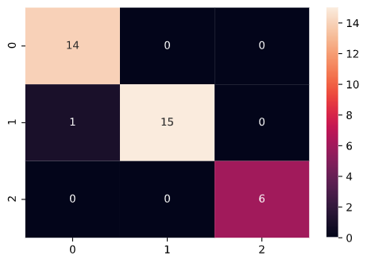
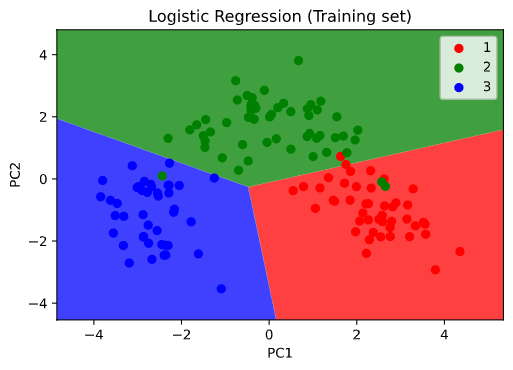
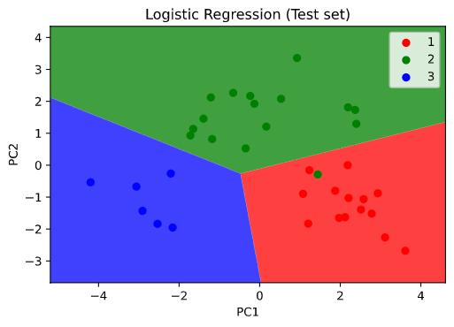
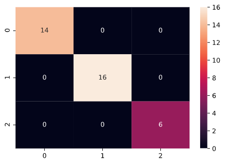
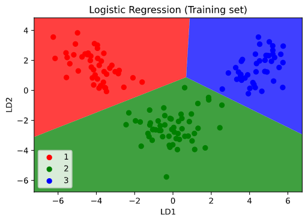
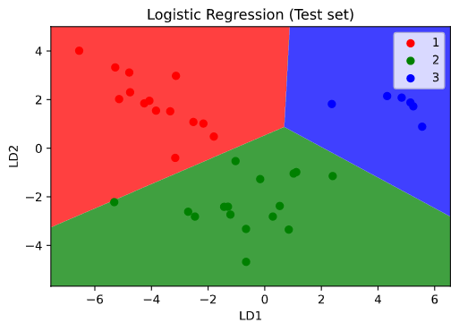
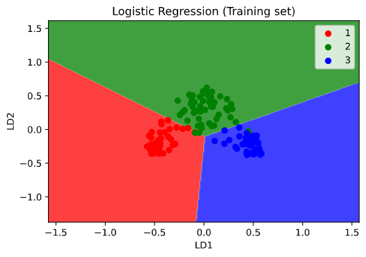
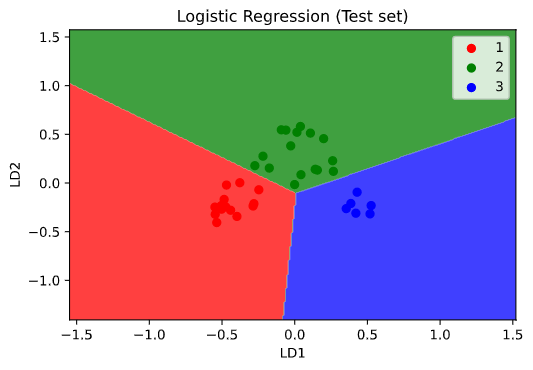

# Wine Quality Segmentation

1. This project uses different dimensionality reduction and classification models to predict and segment the customers who are trying to buy wine of different qualities.

2. The analysis was performed in the following sequential steps:

* Used PCA and logistic regression to predict and visualize to which wine category a customer will belong to.

* Used LDA and logistic regression to predict and visualize to which wine category a customer will belong to.

* Used Kernel PCA and logistic regression to predict and visualize to which wine category a customer will belong to.

